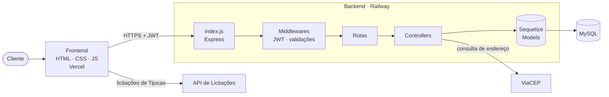
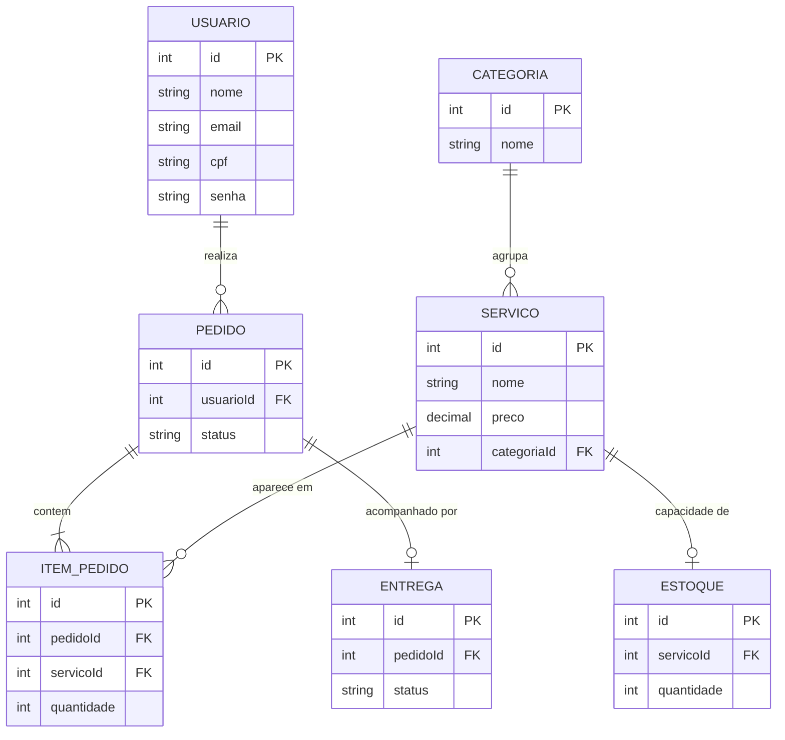
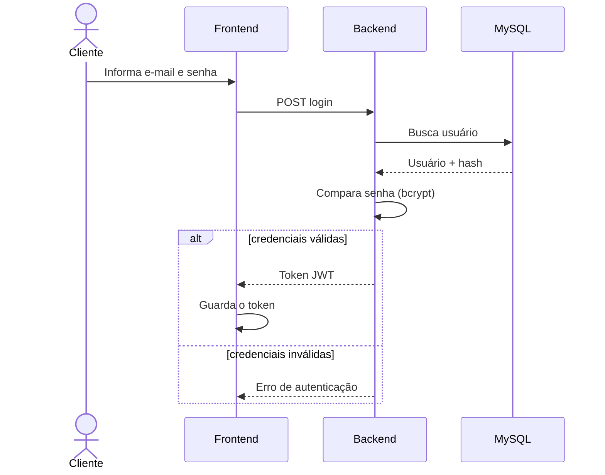
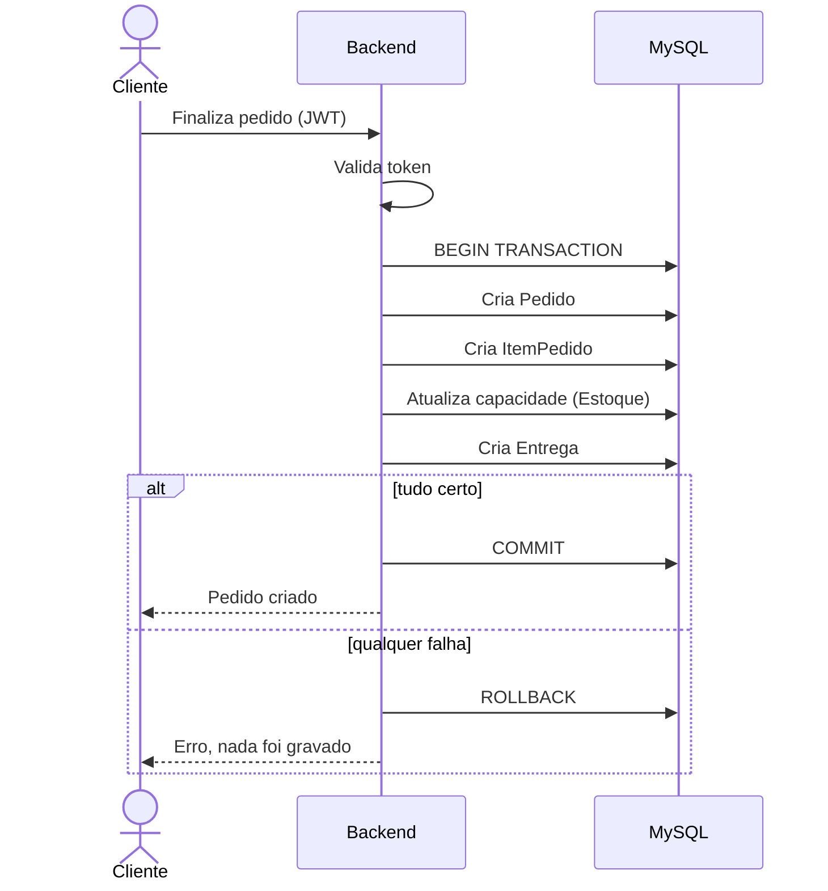

<div align="center">

# Del Company — Backend

**API REST da plataforma de assessoria em licitações**

Autenticação, catálogo de serviços, pedidos e acompanhamento de processos licitatórios.


[Frontend](https://github.com/eli-bernardi/proj-implantar-frontend) · [Site online](https://proj-implantar-frontend.vercel.app) · [Reportar problema](https://github.com/elibernardi1/proj_implantar/issues)

</div>

---

## Sobre o projeto

Este repositório contém o **backend** da **Del Company**, plataforma de consultoria em licitações públicas. A API atende o [frontend do projeto](https://github.com/eli-bernardi/proj-implantar-frontend) e é responsável por:

- cadastro e autenticação de usuários com **JWT**;
- catálogo de **serviços** organizados por **categorias**;
- controle de **capacidade de atendimento** de cada serviço;
- **pedidos** com checkout transacional;
- **acompanhamento do processo licitatório** de cada pedido.

O backend nasceu de um padrão genérico de e-commerce, adaptado ao contexto de consultoria em licitações: o estoque virou **gestão de capacidade** e a entrega virou **acompanhamento do processo**.

## Funcionalidades

- Autenticação com **JWT** e senhas protegidas com **bcrypt**
- Middleware de autorização para rotas protegidas
- Validação de **CPF** no cadastro
- Consulta de endereço pela API **ViaCEP**
- **Checkout transacional**, que garante pedido, itens e capacidade consistentes ou nada é gravado
- Variáveis sensíveis fora do código, via `.env`
- Suíte com **36 testes** automatizados
- Arquivo `teste.http` para testar a API manualmente
- Deploy em **Railway** com MySQL gerenciado

## Tecnologias

| Camada | Tecnologia |
| --- | --- |
| Runtime | Node.js |
| Framework | Express |
| Banco de dados | MySQL |
| ORM | Sequelize |
| Autenticação | JSON Web Token (JWT) |
| Criptografia | bcrypt |
| Integração externa | ViaCEP |
| Hospedagem | Railway |

## Arquitetura



## Modelo de dados

O banco possui **7 modelos** Sequelize.



| Modelo | Papel no domínio de licitações |
| --- | --- |
| `Usuario` | Cliente da assessoria |
| `Categoria` | Agrupa os serviços (ex.: habilitação, análise de editais) |
| `Servico` | Serviço oferecido no catálogo |
| `Estoque` | Capacidade de atendimento do serviço |
| `Pedido` | Solicitação de contratação |
| `ItemPedido` | Serviços incluídos em cada pedido |
| `Entrega` | Acompanhamento do processo licitatório |

## Fluxos principais

### Autenticação



### Checkout transacional



## Estrutura do repositório

```
proj_implantar/
├── src/            # Código da aplicação (models, controllers, rotas, middlewares)
├── test/           # Testes automatizados (36 testes)
├── assets/         # Recursos do projeto
├── index.js        # Ponto de entrada: inicializa o servidor Express
├── sync.js         # Sincronização dos modelos com o banco (Sequelize sync)
├── teste.http      # Requisições de exemplo para testar a API
├── .env.example    # Modelo das variáveis de ambiente
├── package.json
└── package-lock.json
```

## Como executar localmente

### Pré-requisitos

- [Node.js](https://nodejs.org/) 18 ou superior
- [MySQL](https://www.mysql.com/) em execução
- npm

### Passo a passo

**1. Clone o repositório**

```bash
git clone https://github.com/elibernardi1/proj_implantar.git
cd proj_implantar
```

**2. Instale as dependências**

```bash
npm install
```

**3. Configure as variáveis de ambiente**

```bash
cp .env.example .env
```

Abra o `.env` e preencha com os dados do seu MySQL e o segredo do JWT. Use como referência o `.env.example`, que lista todas as variáveis necessárias.

**4. Crie o banco de dados**

```sql
CREATE DATABASE nome_do_banco CHARACTER SET utf8mb4 COLLATE utf8mb4_unicode_ci;
```

**5. Sincronize as tabelas**

```bash
node sync.js
```

**6. Inicie o servidor**

```bash
node index.js
```

## Testando a API

Há duas formas de testar:

**Requisições manuais:** abra o arquivo `teste.http` no VS Code com a extensão [REST Client](https://marketplace.visualstudio.com/items?itemName=humao.rest-client) e clique em *Send Request* acima de cada requisição.

**Testes automatizados:**

```bash
npm test
```

A suíte cobre os 36 cenários do backend, incluindo autenticação, validações e fluxos de pedido.

## Segurança

- Senhas nunca são armazenadas em texto puro (hash com **bcrypt**)
- Rotas protegidas exigem token **JWT** válido
- Segredos e credenciais ficam em variáveis de ambiente
- O arquivo `.env` está no `.gitignore` e **não deve ser versionado**

## Deploy

O backend roda no **Railway**, com banco MySQL gerenciado pela própria plataforma. Na inicialização, o Sequelize sincroniza as tabelas automaticamente e o servidor sobe na porta definida pelo ambiente.

Para publicar uma instância própria:

1. Crie um projeto no Railway e adicione um serviço **MySQL**.
2. Conecte este repositório como um novo serviço.
3. Configure as variáveis de ambiente listadas no `.env.example`.
4. Faça o deploy. O Railway define a porta automaticamente.

## Roadmap

- [x] Modelagem completa (7 modelos)
- [x] Autenticação JWT com bcrypt
- [x] Validação de CPF e integração com ViaCEP
- [x] Checkout transacional
- [x] Suíte de 36 testes
- [x] Deploy no Railway
- [ ] Recuperação de senha
- [ ] Favoritos de licitações
- [ ] Documentação interativa da API (Swagger/OpenAPI)

## Repositórios relacionados

| Repositório | Descrição |
| --- | --- |
| [proj-implantar-frontend](https://github.com/eli-bernardi/proj-implantar-frontend) | Frontend do projeto (HTML, CSS e JS) |

## Autor

**Eli Bernardi**

Projeto desenvolvido durante o curso Técnico em Desenvolvimento de Sistemas, no SESI/SENAI Digital Studios.

---

<div align="center">

**Del Company** © 2026. Todos os direitos reservados.

</div>
